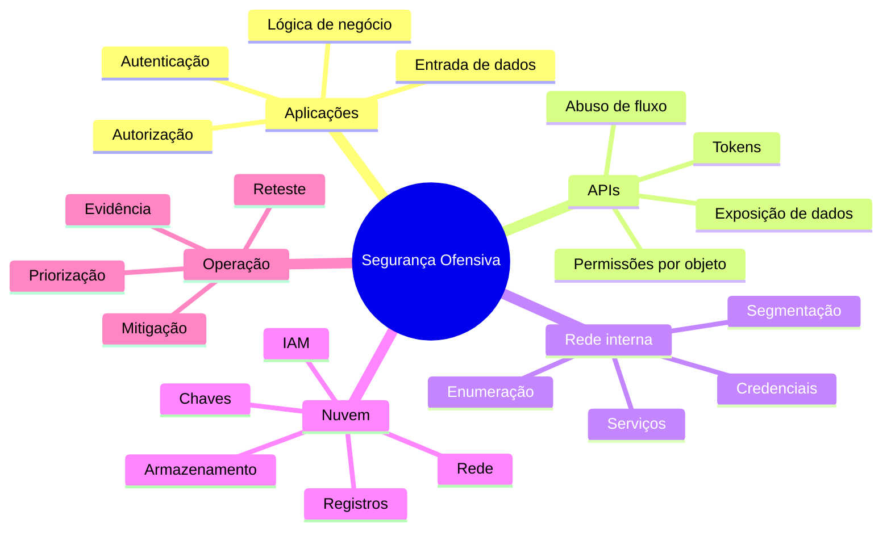
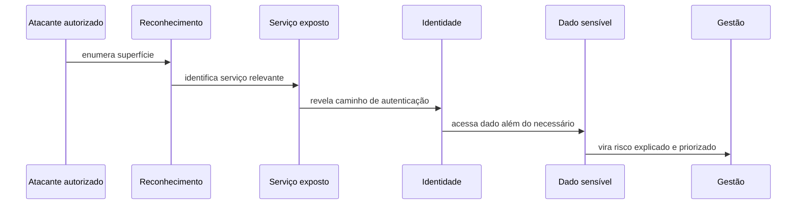
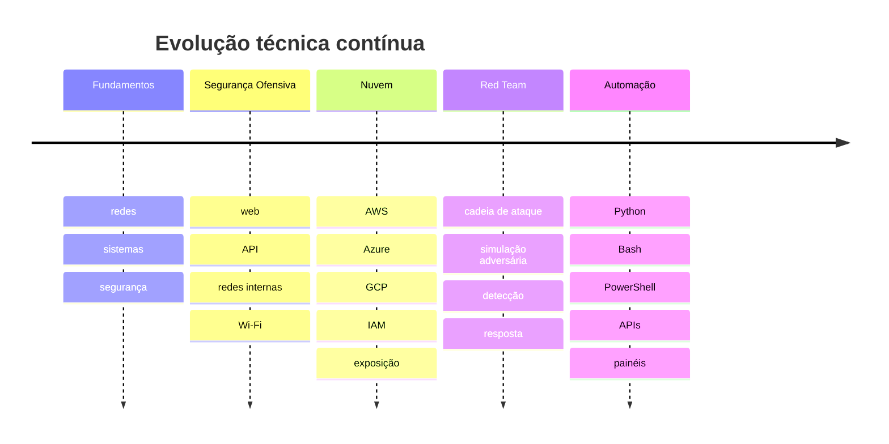

<!--
  README de perfil do GitHub: D3Z33
  Linguagem visual: terminal, neon, segurança ofensiva, nuvem e automação.
-->

<div align="center">


<br />


[](https://linkedin.com/in/renanreis-ciber)
[](https://github.com/D3Z33)
[](https://tryhackme.com/p/D3Z33)
[](https://www.credly.com/users/renan-rocha-dos-reis)

<br />
<br />


<br />
<br />

```bash
┌──(d3z33㉿perfil)-[~/inicio]
└─$ ./quem-sou-eu --modo=ofensivo --idioma=pt-br

nome        : Renan Reis
alias       : D3Z33
trilha      : Segurança Ofensiva, Red Team, Segurança em Nuvem e Automação
postura     : exploração autorizada, documentação clara e redução de risco
objetivo    : transformar exposição técnica em decisão inteligente
```

</div>

---

<div align="center">

### `menu de navegação`

[Sobre](#sobre-o-operador) ·
[Sala Interativa](#sala-interativa) ·
[Mapa de Atuação](#mapa-de-atuação) ·
[Arsenal](#arsenal-técnico) ·
[Metodologia](#metodologia-ofensiva) ·
[Laboratório](#laboratório-e-automações) ·
[Certificações](#certificações) ·
[Efeitos](#efeitos-dinâmicos) ·
[Indicadores](#indicadores-do-github) ·
[Contato](#canais-de-contato)

</div>

---


## `./sala-interativa`

<div align="center">


[](#sobre-o-operador)
[](#arsenal-técnico)
[](#metodologia-ofensiva)
[](#efeitos-dinâmicos)

</div>

<details>
<summary><strong>abrir modo recrutador: leitura rápida e direta</strong></summary>

```txt
o que você encontra aqui:
  - profissional de segurança ofensiva com foco em risco real
  - experiência com web, APIs, redes internas, Wi-Fi e nuvem
  - automação para reduzir trabalho repetitivo e organizar evidências
  - comunicação técnica e executiva para transformar achados em decisão
  - postura responsável: escopo, autorização, impacto e mitigação
```

</details>

<details>
<summary><strong>abrir modo técnico: sinais que eu sigo</strong></summary>

```txt
trilha de raciocínio:
  1. enumerar superfície
  2. separar ruído de sinal
  3. validar hipótese com segurança
  4. provar impacto sem causar dano
  5. documentar evidência reproduzível
  6. priorizar correção por risco
  7. retestar e fechar o ciclo
```

</details>

<details>
<summary><strong>abrir modo red team: narrativa de operação</strong></summary>

```txt
uma operação bem feita precisa responder:
  - o caminho era detectável?
  - o alerta chegaria para alguém?
  - o time saberia investigar?
  - a contenção seria rápida?
  - a organização entende o impacto?
  - a correção reduz o caminho de ataque?
```

</details>

<details>
<summary><strong>abrir mini quiz: pense como atacante autorizado</strong></summary>

| Pergunta | Resposta esperada |
|---|---|
| Uma rota lista dados de outro usuário trocando apenas um ID. O que isso indica? | Falha de autorização por objeto, possível IDOR/BOLA |
| Um papel em nuvem tem permissões amplas sem necessidade operacional. Qual é o risco? | Escalada de impacto por privilégio excessivo |
| Uma falha tem PoC, mas impacto baixo. Ela deve virar crítica? | Não sem contexto real de negócio e exploração |
| Um relatório tem prints, mas não tem reprodução. O que falta? | Evidência estruturada, passos claros e validação |

</details>


## `./sobre-o-operador`

Sou profissional de **Segurança Ofensiva, Red Team e Segurança em Nuvem**, com atuação em testes de intrusão, avaliação de exposição, automação de rotinas de segurança e comunicação de risco para ambientes reais.

Minha forma de trabalhar combina **mentalidade ofensiva**, **método**, **responsabilidade** e **clareza**. O objetivo não é apenas encontrar uma falha isolada. O objetivo é entender o caminho, validar o impacto, registrar evidências e ajudar a organização a sair mais forte do outro lado.

Gosto de atuar onde a teoria encontra o ambiente vivo: aplicações com regras de negócio, APIs com permissões sensíveis, redes internas com serviços esquecidos, identidades em nuvem com privilégios demais, registros que contam histórias incompletas e times que precisam transformar ruído em prioridade.

> Segurança ofensiva não é espetáculo vazio. É investigação técnica com permissão, profundidade, contexto e consequência.

```txt
princípios:
  - autorização antes de qualquer teste
  - escopo bem definido
  - exploração controlada
  - evidência reproduzível
  - impacto explicado em linguagem humana
  - recomendação prática, priorizada e aplicável
```

---

## `cat manifesto.txt`

```txt
Eu não olho para um alvo apenas como uma lista de portas, rotas e serviços.
Eu olho para relações.

Onde uma identidade alcança outra.
Onde uma permissão pequena vira privilégio grande.
Onde uma API confia demais.
Onde um armazenamento público conta uma história que ninguém pretendia publicar.
Onde uma regra de negócio vira vetor.
Onde um registro mostra o ataque, mas ninguém está olhando.

Meu trabalho é caminhar por esses pontos com autorização,
produzir evidência, explicar risco e ajudar a fechar caminhos.
```

---

## `./painel-de-sinais`

<div align="center">

| Sinal | Interpretação |
|---|---|
| **Exposição externa** | O que pode ser visto, tocado, enumerado e testado por um atacante |
| **Identidade e acesso** | Onde permissões, papéis e credenciais podem virar caminho de abuso |
| **Aplicações e APIs** | Onde autenticação, autorização, lógica e entrada de dados podem falhar |
| **Rede interna** | Onde serviços, relações de confiança e segmentação definem o impacto |
| **Nuvem** | Onde IAM, armazenamento, rede, registros e chaves contam a história do ambiente |
| **Detecção e resposta** | Onde a organização percebe, investiga, contém e aprende |

</div>

<br />

<div align="center">


</div>

---


## `./mapa-de-atuação`

| Frente | O que eu procuro | Como eu valido | O que entrego |
|---|---|---|---|
| **Pentest Web** | Falhas de autenticação, autorização, entrada de dados, sessão e lógica | Testes manuais, PoCs controladas e cadeia de exploração | Evidência, impacto, severidade e correção |
| **Pentest de APIs** | IDOR, BOLA, BFLA, exposição de dados, abuso de método e fluxos inseguros | Coleções, geração controlada de entradas, análise de token, matriz de permissão e abuso de negócio | Mapa de rotas, riscos e recomendações |
| **Redes Internas** | Serviços expostos, credenciais, enumeração, caminhos de privilégio e movimentação | Reconhecimento, validação de acesso e simulação segura de caminhos | Narrativa de ataque e plano de endurecimento |
| **Wi-Fi** | Configurações fracas, segmentação ruim, exposição de rede e riscos operacionais | Análise de configuração, captura autorizada e validação de alcance | Risco técnico e recomendações de arquitetura |
| **Segurança em Nuvem** | IAM excessivo, repositórios de armazenamento expostos, chaves, registros ausentes, redes abertas e serviços públicos | Revisão de configuração, telemetria, enumeração e análise de privilégio | Mapa de exposição e priorização |
| **Automação** | Trabalho repetitivo, evidência espalhada e baixa visibilidade | Scripts, APIs, integrações e painéis simples | Rotina mais rápida, organizada e auditável |
| **Relatórios** | Ruído técnico sem decisão clara | Escrita técnica, resumo executivo e priorização | Documento útil para técnico, gestão e negócio |

---

## `./radar-de-risco --visão=executiva`



---


## `ls -la arsenal-técnico/`

<div align="center">


</div>

<br />

<div align="center">


</div>

```bash
arsenal-técnico/
├── reconhecimento/
│   ├── nmap
│   ├── httpx
│   ├── ffuf
│   ├── nuclei
│   └── osint
├── web-e-api/
│   ├── burp-suite
│   ├── análise-manual
│   ├── geração-controlada-de-entradas
│   ├── autenticação
│   ├── autorização
│   └── lógica-de-negócio
├── rede-interna/
│   ├── enumeração
│   ├── serviços
│   ├── credenciais
│   ├── segmentação
│   └── caminhos-de-impacto
├── nuvem/
│   ├── aws
│   ├── azure
│   ├── gcp
│   ├── iam
│   ├── armazenamento
│   ├── rede
│   └── telemetria
├── automação/
│   ├── python
│   ├── bash
│   ├── powershell
│   ├── docker
│   ├── apis
│   └── painéis
└── entrega/
    ├── evidência
    ├── prova-de-conceito
    ├── severidade
    ├── resumo-executivo
    └── plano-de-mitigação
```

---

## `./matriz-de-habilidades`

| Categoria | Habilidades |
|---|---|
| **Segurança Ofensiva** | Pentest web, API, rede interna, Wi-Fi, nuvem e multi-nuvem |
| **Vulnerabilidades** | IDOR, XSS, SQLi, SSRF, LFI/RFI, RCE, falhas de autenticação, autorização e lógica |
| **Nuvem e Infraestrutura** | IAM, armazenamento, redes, exposição pública, chaves, registros, telemetria e arquitetura |
| **Automação** | Python, Bash, PowerShell, Docker, Git, APIs, organização de evidências e pequenos serviços |
| **Relatórios** | Escrita técnica, resumo executivo, priorização, impacto, recomendação e reteste |
| **Referenciais** | OWASP Top 10, OWASP API Security Top 10, MITRE ATT&CK, ISO 27001 e LGPD |

---


## `./metodologia-ofensiva --com-evidência`

```mermaid
flowchart LR
    A[Escopo] --> B[Reconhecimento]
    B --> C[Superfície de ataque]
    C --> D[Hipóteses]
    D --> E[Validação]
    E --> F[Exploração controlada]
    F --> G[Evidências]
    G --> H[Impacto no negócio]
    H --> I[Recomendações]
    I --> J[Priorização]
    J --> K[Reteste]

    style A fill:#001b0b,stroke:#00ff41,color:#ffffff
    style F fill:#002b12,stroke:#00ff41,color:#ffffff
    style H fill:#003b18,stroke:#00ff41,color:#ffffff
    style K fill:#001b0b,stroke:#00ff41,color:#ffffff
```



### `fase 01: escopo`

Antes de qualquer teste, o escopo precisa estar claro: ativos, limites, janelas, regras de engajamento, contatos, impacto aceitável e o que não deve ser tocado. Um bom teste começa antes da primeira requisição.

### `fase 02: reconhecimento`

Aqui a superfície começa a aparecer. Domínios, subdomínios, portas, tecnologias, rotas, serviços, integrações, identidades, repositórios de armazenamento, aplicações, painéis, versões e pequenas pistas que, juntas, contam uma história.

### `fase 03: validação`

Nem todo achado é vulnerabilidade. Nem toda vulnerabilidade vira risco crítico. A validação separa ruído de sinal e evita relatório inflado. O foco é reproduzir com segurança e provar impacto sem causar dano.

### `fase 04: exploração controlada`

Explorar não é destruir. É demonstrar caminho, limite e consequência. O ponto é responder perguntas: o que um atacante conseguiria fazer, até onde iria, que dado acessaria, que privilégio obteria e qual seria o impacto real.

### `fase 05: comunicação`

Um bom relatório não é só uma coleção de prints. Ele precisa mostrar contexto, vetor, evidência, impacto, severidade, recomendação e prioridade. A pessoa técnica precisa conseguir corrigir. A gestão precisa conseguir decidir.

---

## `./cadeia-de-ataque --exemplo-conceitual`



> A parte mais importante de uma cadeia de ataque não é a estética da exploração. É a clareza do impacto.

---

<details>
<summary><strong>abrir dossiê: como penso durante um teste</strong></summary>

```txt
perguntas que ficam rodando:

1. O que este ativo revela sem autenticação?
2. O que muda quando entro com um usuário comum?
3. Existe diferença real entre papéis e permissões?
4. Um objeto de outro usuário pode ser acessado por troca de identificador?
5. O servidor confia demais na interface?
6. Existe rota esquecida, legada ou sem documentação?
7. Alguma integração vaza segredo, token ou metadado?
8. A nuvem está registrando o suficiente para investigação?
9. Uma permissão isolada pode virar privilégio maior?
10. O time conseguiria detectar esse caminho em tempo útil?
```

</details>

---


## `./laboratório-e-automações`

Gosto de criar ferramentas pequenas, diretas e úteis. Nem toda automação precisa nascer gigante. Às vezes o que muda o jogo é um script que organiza evidências, uma API que cruza ativos, um painel que mostra prioridade ou uma rotina que transforma horas de trabalho repetitivo em minutos verificáveis.

```txt
ideias que me interessam:
  - inventário de ativos e superfície exposta
  - normalização de achados de pentest
  - coleta de evidências com rastreabilidade
  - painéis para vulnerabilidades e severidade
  - integração entre ferramentas de reconhecimento e relatórios
  - análise de permissões em ambientes de nuvem
  - correlação entre registros, ativos e risco
  - automações simples para times técnicos
```

| Tipo de automação | Valor prático |
|---|---|
| **Coleta de evidência** | Reduz perda de contexto e melhora rastreabilidade |
| **Organização de ativos** | Ajuda a entender superfície real |
| **Padronização de achados** | Evita relatório inconsistente |
| **Painéis internos** | Facilita priorização e acompanhamento |
| **Scripts de apoio** | Economiza tempo em tarefas repetitivas |
| **APIs internas** | Conecta dados que normalmente ficam espalhados |

---

## `./qualidade-de-entrega`

```txt
um achado bom precisa responder:

o que é?
onde está?
como reproduzir?
qual é a evidência?
qual é o impacto?
qual é a severidade?
como corrigir?
como validar a correção?
qual é a prioridade?
quem precisa entender isso?
```

| Público | O que precisa receber |
|---|---|
| **Time técnico** | Passos claros, evidência, causa provável e caminho de correção |
| **Gestão** | Impacto, prioridade, risco e esforço de mitigação |
| **Negócio** | Consequência prática, exposição e decisão necessária |
| **Segurança** | Cadeia de ataque, controles ausentes, detecção e resposta |

---


## `cat certificações.log`

| Certificação | Emissor | Foco |
|---|---|---|
| **CyberOps Associate** | Cisco | Operações de segurança, monitoramento e fundamentos defensivos |
| **CCST Cybersecurity** | Cisco | Fundamentos de cibersegurança |
| **Pentester** | IBSec | Testes de intrusão e análise ofensiva |
| **SYCP** | Solyd Certified Pentester | Pentest e prática ofensiva |
| **CRTA** | CyberWarFare Labs | Red Team Analyst |
| **MCRTA** | CyberWarFare Labs | Analista de Red Team Multi-Nuvem |

```txt
trilhas_em_evolução:
  - Red Team
  - Segurança em Nuvem
  - Desenvolvimento de Exploits
  - Automação aplicada à segurança
  - Detecção, resposta e telemetria
```

---

## `./linha-de-estudo --contínua`



---


## `./efeitos-dinâmicos`

<div align="center">

[](https://github.com/D3Z33/D3Z33/actions/workflows/cobra-de-contribuicoes.yml)
[](https://github.com/D3Z33/D3Z33/actions/workflows/contribuicoes-3d.yml)

<br />
<br />


<br />
<br />


</div>

<details>
<summary><strong>como esses efeitos ganham vida no GitHub</strong></summary>

```txt
efeito 01: cobra de contribuições
  arquivo: .github/workflows/cobra-de-contribuicoes.yml
  resultado: branch output com SVG animado das contribuições

efeito 02: gráfico 3D
  arquivo: .github/workflows/contribuicoes-3d.yml
  resultado: pasta profile-3d-contrib com arte 3D atualizada

observação:
  depois de subir no repositório do perfil, basta executar os workflows uma vez.
  o README passa a se atualizar como uma vitrine viva.
```

</details>

---


## `github --indicadores`

<div align="center">


<br />
<br />


<br />
<br />


<br />
<br />


<br />
<br />


<br />
<br />


</div>

---

## `./painel-de-presença`

```txt
status atual:
  estudando continuamente
  construindo ferramentas
  refinando metodologia
  explorando segurança em nuvem
  conectando ofensiva com impacto de negócio
```

<div align="center">

| Mentalidade | Descrição |
|---|---|
| **Curiosidade técnica** | Investigar com profundidade, sem aceitar a primeira resposta |
| **Calma operacional** | Trabalhar com método mesmo em cenário crítico |
| **Responsabilidade** | Respeitar escopo, autorização, impacto e privacidade |
| **Comunicação** | Traduzir detalhe técnico em decisão compreensível |
| **Evolução constante** | Aprender, testar, errar em laboratório e melhorar |

</div>

---

## `./frases-que-resumem`

```txt
"Sem evidência, é opinião."
"Sem contexto, severidade vira chute."
"Sem escopo, teste vira risco."
"Sem correção, achado vira dívida."
"Sem comunicação, técnica não vira decisão."
```

---

<details>
<summary><strong>abrir arquivo oculto: bastidores do perfil</strong></summary>

```txt
Este perfil foi pensado para causar uma impressão forte sem perder profissionalismo.

A estética é hacker, mas a mensagem é madura:
  - testar apenas com autorização
  - explicar risco com clareza
  - conectar técnica com negócio
  - usar automação para ganhar consistência
  - tratar segurança como melhoria contínua

A ideia é que o GitHub não seja só uma vitrine de repositórios.
Ele também pode ser uma superfície narrativa:
um lugar onde a pessoa entende como você pensa,
como você trabalha e que tipo de problema você gosta de resolver.
```

</details>

---


## `./canais-de-contato`

<div align="center">

[](https://linkedin.com/in/renanreis-ciber)
[](https://github.com/D3Z33)
[](https://tryhackme.com/p/D3Z33)
[](https://www.credly.com/users/renan-rocha-dos-reis)

<br />
<br />

```bash
┌──(d3z33㉿perfil)-[~/fim]
└─$ echo "Explorar com permissão. Evidenciar com precisão. Corrigir com propósito."
```

</div>

---

<div align="center">


`teste autorizado` · `segurança ofensiva` · `red team` · `segurança em nuvem` · `automação` · `redução de risco`

</div>
